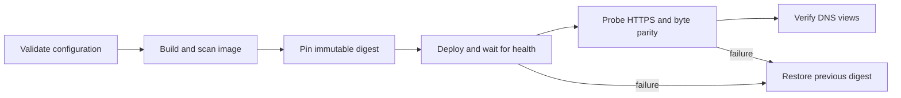

# ASGI and container deployment

automx 3.0 is ASGI-only. Run it with the packaged command:

```console
automx serve --config /etc/automx/automx.conf --host 127.0.0.1 --port 8000
```

Terminate public TLS at a maintained reverse proxy and forward only the
documented paths. Do not forward a client-supplied base URL into automx. Health
checks use `/health/live` and `/health/ready`; those routes intentionally expose
no configuration.

When running behind a proxy, configure trusted forwarded-header handling at the
process or ingress boundary. The packaged command disables proxy-header trust by
default. Do not expose Uvicorn directly to an untrusted network.

## Container quick start

The root `Dockerfile` is multi-stage and runs as UID/GID 10001. Mount the
configuration read-only:

```console
docker compose up --build
```

The supplied Compose service binds only to `127.0.0.1:8000`, drops all Linux
capabilities, enables `no-new-privileges`, uses a read-only root filesystem, and
provides a bounded `/tmp` tmpfs. Adjust the host binding only when a trusted
reverse proxy or network policy protects the service.

Create and scan supply-chain artifacts with `make sbom` and `make scan`.
See the [container scan details](security/container-scan.md). A synthetic,
digest-pinned Traefik deployment is available in the
[production example](../contrib/production-example/README.md).

## Production rollout

Keep the image, HTTP representation, and DNS digest as one reviewed release
unit. The safe path is:



Before changing a running service, record the current image digest and keep its
configuration available for rollback. Build and scan the candidate as described
in [Tests, E2E, SBOM, and scans](testing.md), then validate the exact deployment
files:

```console
automx config validate --config /etc/automx/automx.conf --domain example.test
automx openapi check --config /etc/automx/automx.conf
docker compose config --quiet
```

Set the reviewed immutable digest in the deployment environment, then update
only the automx service and wait for its readiness check:

```console
docker compose pull automx
docker compose up -d --no-deps --wait automx
```

Verify the public route with a visibly synthetic address and compare the remote
PACC bytes with the deployed configuration:

```console
automx probe all --base-url https://ua-auto-config.example.test \
  --email probe@example.test --config /etc/automx/automx.conf \
  --domain example.test
automx dns check --config /etc/automx/automx.conf \
  --service-host automx.example.test --nameserver 192.0.2.53
```

Run `dns check` separately for every authoritative and required recursive view.
Do not interpret one resolver failure as proof that a record is absent.

## Rollback

Restore the previous immutable image digest, validate Compose again, and
recreate only the automx service. Repeat the readiness, public probe, PACC byte
parity, and DNS-view checks before declaring recovery. If PACC bytes changed,
retain both old and new TXT digests for the cache-safe interval described in
[Migration from automx 1.x](migration.md); never roll HTTP and DNS back as
independent changes.
